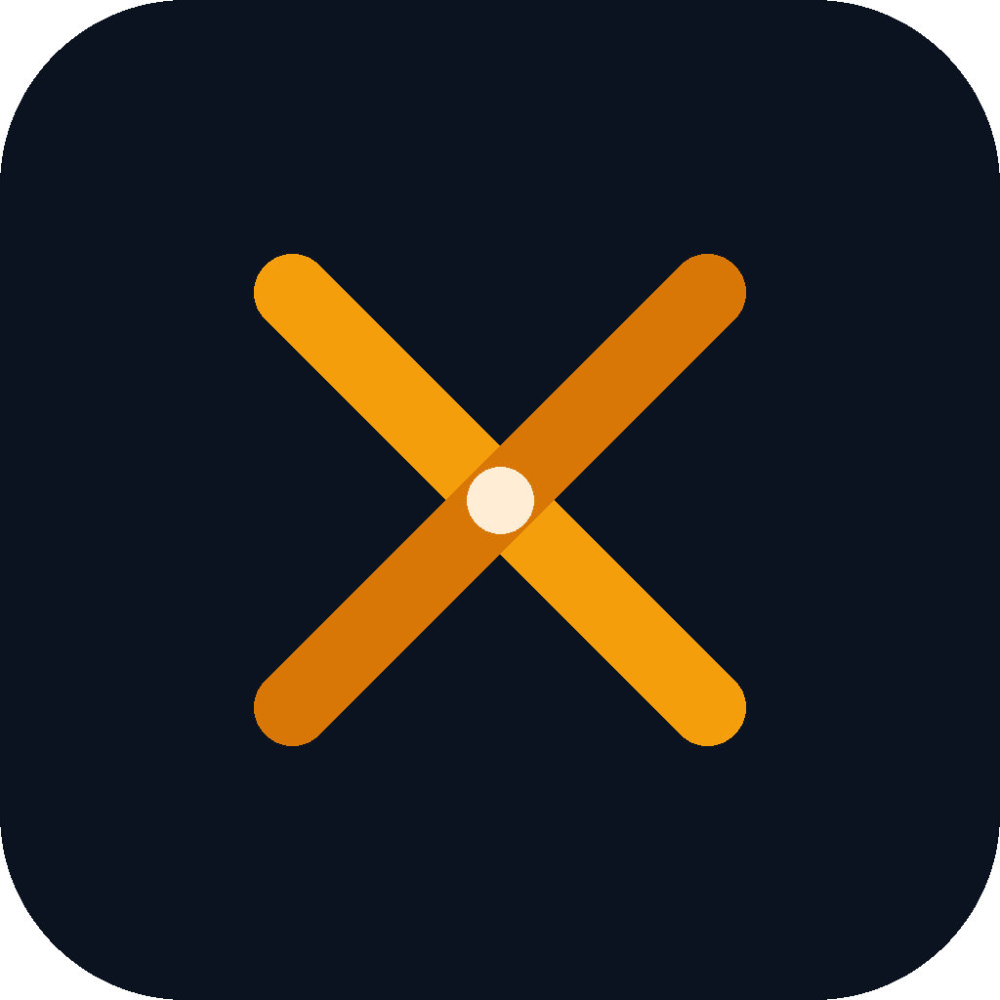
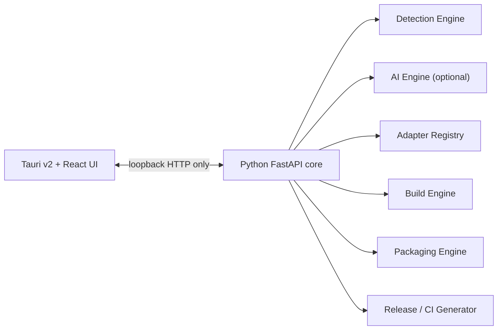

<p align="center">
  
</p>

<h1 align="center">Crossmith</h1>
<p align="center"><strong>Any codebase. Every platform. Zero config.</strong></p>

<p align="center">
  <a href="https://github.com/niknam1382/crossmith/actions/workflows/ci.yml"></a>
  <a href="LICENSE"></a>
  <a href="https://github.com/niknam1382/crossmith/releases"></a>
  <a href="CONTRIBUTING.md"></a>
  <a href="https://github.com/niknam1382/crossmith/stargazers"></a>
</p>

<p align="center">
  <!-- TODO: replace with a real demo GIF once the MVP UI exists — docs/assets/demo.gif -->
  
</p>

Drag in a project folder. Crossmith figures out what it is, builds it in a
clean isolated environment, and hands you back real, ready-to-run installers
— without uploading your source code anywhere.

---

## Why Crossmith

Packaging is the tax every project pays right before it's supposed to be
done. You know the drill: the right PyInstaller flags, an icon in the wrong
format, a GitHub Actions matrix you copy from a different repo and half
understand, a Windows Defender false-positive on release day. Crossmith
exists so none of that is your problem anymore.

## Features

- 🖱️ **Drag, drop, build.** A folder, a single file, or a Git URL — no spec
  file to hand-write.
- 🔍 **Confidence-scored detection.** Language, framework, entry point,
  dependencies, icon, and metadata — and when confidence is low, you get a
  manual-override screen instead of a silent wrong guess.
- 🔒 **Privacy-first, offline-friendly.** Your source code is never uploaded
  by default. AI-assisted analysis runs locally or not at all.
- 📦 **Isolated, reproducible builds.** Every build gets its own clean
  environment, a manifest, and a checksum.
- 🧩 **Built to be extended.** Language and platform support is a plugin
  interface, not a hardcoded list — see [supported languages](#supported-languages).
  below.
- 🚀 **CI generated for you.** For platforms Crossmith can't build on your
  local OS, it writes you a working GitHub Actions pipeline — the same one
  it uses to release itself.
- 🎨 **Looks like a real product.** Dark/light mode, live build logs, no
  terminal required (though the terminal-style log panel is right there if
  you want it).

## Screenshots

<!-- TODO: add real screenshots once the desktop UI exists -->
| Drop a project | Live build | Results |
|---|---|---|
| `docs/assets/screenshot-drop.png` | `docs/assets/screenshot-build.png` | `docs/assets/screenshot-results.png` |

## Quick start

```bash
# Coming soon — Crossmith is pre-release. Star/watch the repo to get notified.
# Planned installation, once released:
curl -fsSL https://crossmith.dev/install.sh | sh        # macOS / Linux
winget install Crossmith.Crossmith                        # Windows (planned)
```

Until then, run it from source — see [Development setup](CONTRIBUTING.md#development-setup)
in `CONTRIBUTING.md`.

## Usage

1. Open Crossmith.
2. Drag in a project folder (or paste a Git URL).
3. Review what it detected — accept it, or fix anything it got wrong.
4. Click **Build**.
5. Find your installers, checksums, and a build manifest in `dist/`.

## Supported languages

| Language | Status |
|---|---|
| Python | ✅ MVP |
| Node.js / TypeScript | 🗺️ Roadmap |
| Go | 🗺️ Roadmap |
| Rust | 🗺️ Roadmap |
| Java / Kotlin | 🗺️ Roadmap |
| Flutter | 🗺️ Roadmap |
| .NET | 🗺️ Roadmap |

New languages are added as [adapters](docs/guides/adapter-development.md) —
community contributions welcome, see [`CONTRIBUTING.md`](CONTRIBUTING.md).

## Supported output platforms

Native compilers build for the OS they run on — that's a fact about how
compilation works, not a Crossmith limitation. So: **local build** = real,
tested, produced right now on your machine. **CI-generated** = Crossmith
writes you a working GitHub Actions pipeline that builds it on push, on a
real runner for that OS.

| Platform | MVP | Path |
|---|---|---|
| Windows `.exe` | ✅ | Local (on Windows) or CI |
| Linux binary + AppImage | ✅ | Local (on Linux) or CI |
| macOS `.app` | ✅ | Local (on macOS) or CI |
| Linux `.deb` / `.rpm` / Snap / Flatpak | 🗺️ Roadmap | CI |
| Windows installer (MSI/NSIS) | 🗺️ Roadmap | CI |
| macOS `.dmg` + notarization | 🗺️ Roadmap | CI (notarization needs your own Apple credentials) |
| Android APK/AAB | 🗺️ Roadmap | — |
| iOS IPA | 🗺️ Roadmap | Generated Xcode/fastlane pipeline — the signing step always runs on your own Mac; nothing can automate around Apple's requirement for that |
| Web / WASM | 🗺️ Roadmap | — |

## AI & privacy

Crossmith's detection engine is deterministic by default — plain heuristic
file/AST scanning, no model required. An optional local AI assist (built on
[cactus-compute/needle](https://github.com/cactus-compute/needle), a small
on-device model) can help with messy or ambiguous projects. It is:

- **Off by default**, opt-in per project
- **Fully local** — nothing about your code is sent anywhere
- **Never load-bearing** — if it's unavailable, low-confidence, or errors,
  Crossmith falls back to the deterministic engine and asks you instead of
  guessing

## How Crossmith compares

Crossmith isn't a replacement for any of these — it orchestrates them.

| Tool | What it does | Where Crossmith fits |
|---|---|---|
| PyInstaller / Nuitka | Freeze Python into a single-OS binary | Crossmith picks the right one and drives it for you |
| Tauri / Electron | Desktop app shell frameworks | Crossmith is *built with* Tauri — not something you configure |
| fastlane | iOS/Android signing & release automation | Crossmith generates the pipeline; the Apple-side signing step still needs your Mac and credentials |
| electron-builder | Multi-OS packaging for Electron apps | Same idea, but Electron-only; Crossmith is language-agnostic by design |

## Architecture



Full write-up: [`docs/DECISIONS.md`](docs/DECISIONS.md) ·
[`docs/architecture/`](docs/architecture/).

## Roadmap

- [x] Phase 0 — Strategy & decisions
- [ ] Phase 1 — Repository scaffold *(this PR)*
- [x] Phase 2 — Core app shell + detection engine
- [ ] Phase 3 — Python adapter MVP (Windows/Linux/macOS local builds)
- [ ] Phase 4 — Optional local AI assist (Needle)
- [ ] Phase 5 — Build engine hardening (sandboxing, caching, retries)
- [ ] Phase 6 — More languages, Android
- [ ] Phase 7 — GitHub release excellence, docs site, launch

Details: [`docs/DECISIONS.md` §6](docs/DECISIONS.md#6-mvp-scope).

## FAQ

**Does my code ever leave my machine?**
No, not by default. Everything — detection, builds, optional AI — runs
locally. See [AI & privacy](#ai--privacy).

**Can it really build a Windows `.exe` from my Mac?**
Not natively, no compiler does that. Crossmith builds locally for whatever
OS it's running on, and generates a CI pipeline for the rest. See
[Supported output platforms](#supported-output-platforms).

**Will my built app get flagged by antivirus software?**
Less likely than with raw PyInstaller output — Crossmith defaults to Nuitka,
which compiles to real native code. It can still happen; see
[`docs/guides/troubleshooting.md`](docs/guides/troubleshooting.md).

**Can I add support for my favorite language?**
Yes — that's exactly what the adapter system is for. See
[`docs/guides/adapter-development.md`](docs/guides/adapter-development.md).

## Troubleshooting

See [`docs/guides/troubleshooting.md`](docs/guides/troubleshooting.md). Can't
find your issue? [Open one](.github/ISSUE_TEMPLATE/bug_report.yml).

## Contributing

Contributions are very welcome — see [`CONTRIBUTING.md`](CONTRIBUTING.md) for
dev setup, coding standards, and how to add a new adapter. Please also read
the [Code of Conduct](CODE_OF_CONDUCT.md).

## License

[Apache License 2.0](LICENSE) © Crossmith Contributors.

---

<p align="center">If Crossmith saves you an afternoon of packaging pain, a ⭐ helps other people find it.</p>
